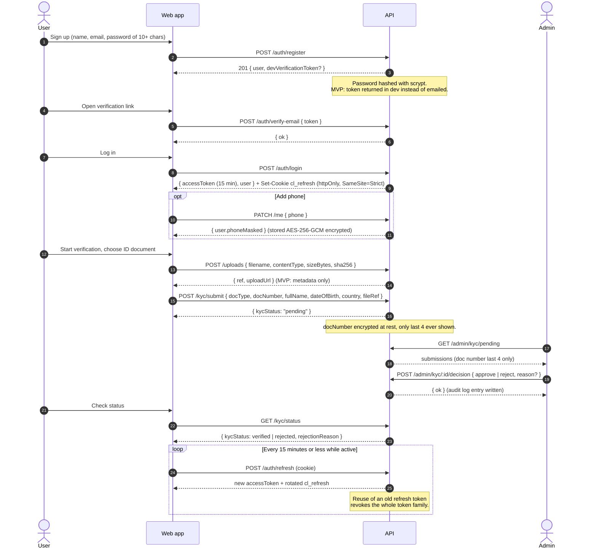
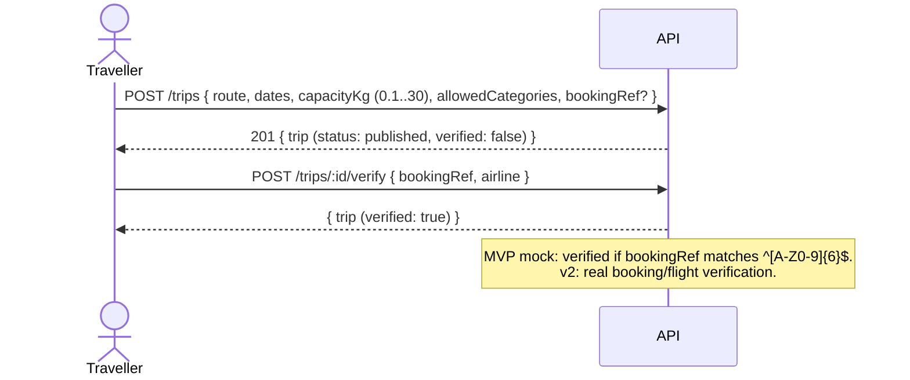
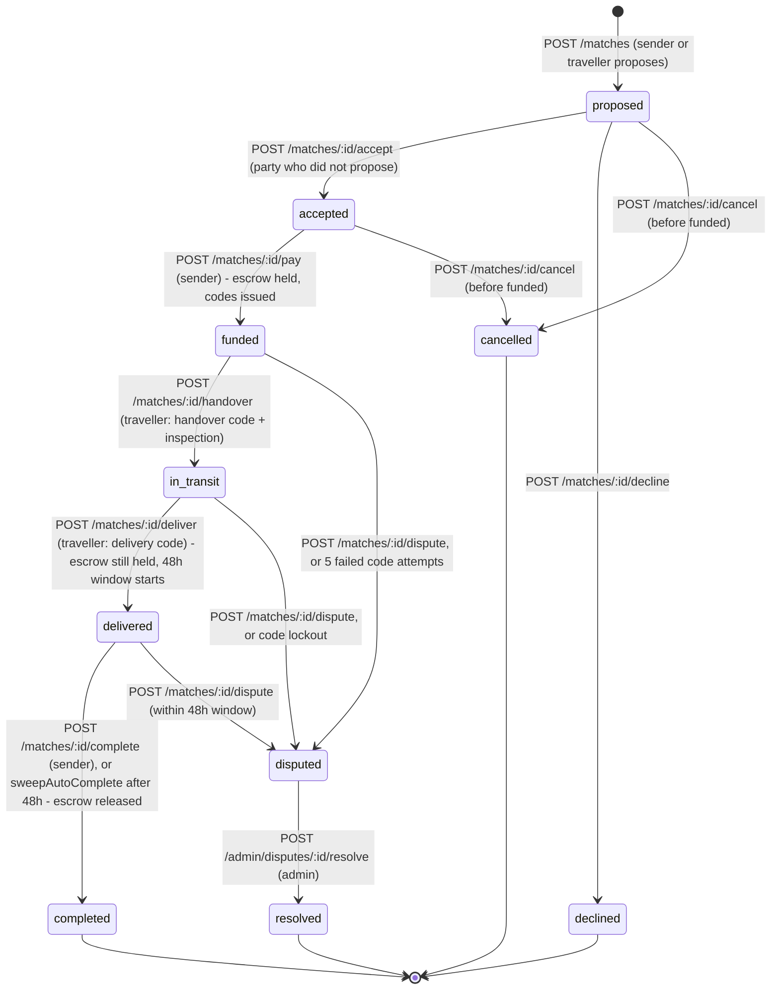
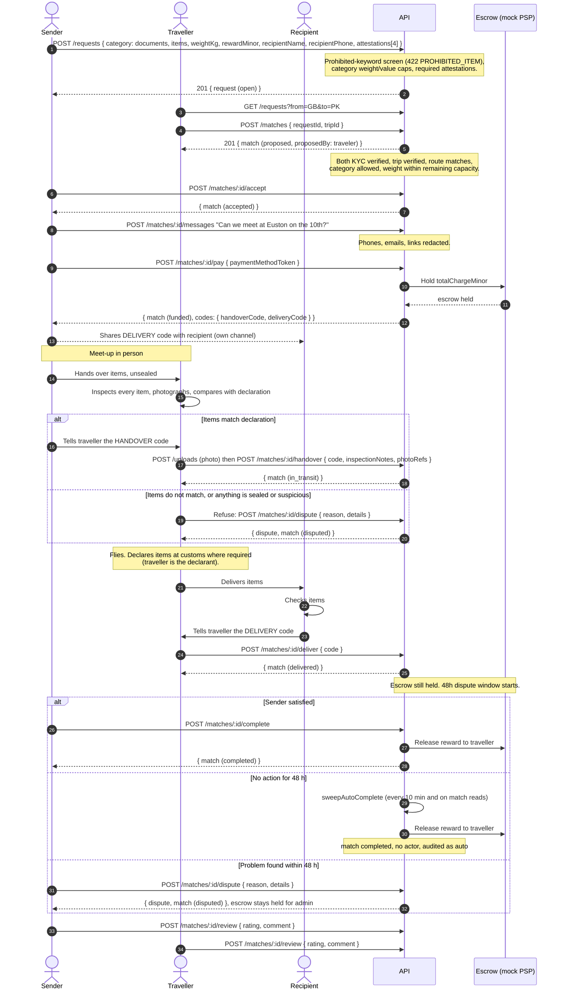
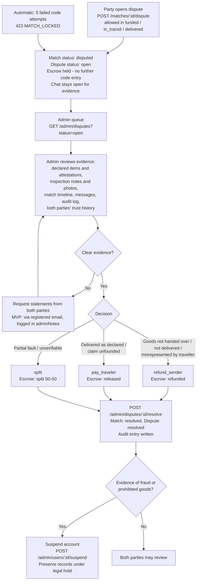
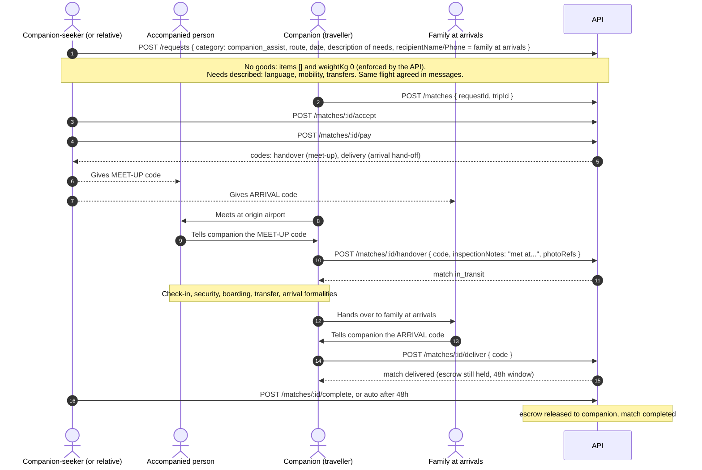

# CarryLink — Workflows

All endpoint paths are relative to `/api/v1` and all status names are exactly those in
[API.md](./API.md). Diagrams are Mermaid and render on GitHub.

Contents:
1. Onboarding and KYC
2. Match lifecycle (state diagram)
3. Sender → traveller → recipient, with escrow and both codes
4. Dispute resolution
5. `companion_assist` variant
6. Plain-language steps per persona

---

## 1. Onboarding and KYC

A user must have a **verified email** and **KYC status `verified`** before they can post a trip, post a
request or create a match. Browsing is open to any logged-in user.

Travellers additionally verify each trip before it can be matched:

---

## 2. Match lifecycle

This is the `MatchStatus` lifecycle from API.md. Terminal states are `completed`, `declined`,
`cancelled` and `resolved`.

### What else changes at each step

| Match status | Escrow (`EscrowStatus`) | Request (`RequestStatus`) | Who can act next | Messaging |
|---|---|---|---|---|
| `proposed` | none | `open` | Non-proposing party: accept / decline. Either: cancel | No |
| `accepted` | none | `matched` (other `proposed` matches on the request are auto-declined) | Sender: pay. Either: cancel | Yes |
| `funded` | `held` | `matched` | Traveller: handover. Either: dispute. Sender: view codes | Yes |
| `in_transit` | `held` | `in_transit` | Traveller: deliver. Either: dispute. Sender: view codes | Yes |
| `delivered` | `held` (48 h dispute window running) | `delivered` | Sender: complete. Either: dispute (48 h), review | Yes |
| `completed` | `released` (trust score +3 traveller, +2 sender) | `completed` | Either: review | No |
| `disputed` | `held` until resolution | `disputed` | Admin: resolve. Both: message and provide evidence | Yes |
| `resolved` | `refunded` / `released` / `split` (losing party's trust score −10 on refund/pay outcomes) | per outcome | Either: review | No |
| `declined`, `cancelled` | none | cancelling an `accepted` match returns the request to `open` | — | No |

Notes:
- Messaging is open while the match is `accepted`, `funded`, `in_transit`, `delivered` or `disputed`. It stays
  open during a dispute on purpose, so both parties can talk and provide evidence.
- A trip cannot be cancelled, and a request cannot be cancelled, once any match on it is `funded` or later (409).
- The match status is the authoritative lifecycle; request status mirrors it.
- **Escrow is released at `completed`, not at `delivered`.** Entering the delivery code starts the 48 h
  dispute window with the funds still `held`. Completion happens when the sender calls
  `POST /matches/:id/complete`, or automatically when the window lapses: `sweepAutoComplete` runs every
  10 minutes on the server and lazily on match reads, and completes the match with no actor. A dispute
  opened during the window therefore still has the full amount to refund or split.
- Every match that is not `proposed`, `declined` or `cancelled` consumes trip capacity, including
  `completed` and `resolved` ones.

---

## 3. Sender → traveller → recipient

Illustrated for a `documents` request on the seeded LHR → ISB route. Fees use `GET /meta/fees`
(15 % platform fee on the reward, 100 minor-unit protection fee).

Rules that make this safe:
- The **handover code** is only given *after* the traveller has inspected the goods. The traveller never
  receives a code from the system.
- The **delivery code** is only given by the recipient *after* they physically have the goods.
- Codes are compared in constant time. A wrong code returns `400 INVALID_CODE` with `details.attemptsLeft`;
  the 5th wrong attempt returns `423 MATCH_LOCKED`, locks the match and opens a dispute automatically.
- The traveller is paid only when the match completes, not at delivery.

---

## 4. Dispute resolution

Guidelines for admins (MVP):

| Situation | Typical resolution |
|---|---|
| Traveller refused at handover because items were sealed, mismatched or suspicious | `refund_sender`; consider suspending the sender if the item appears prohibited |
| Handover code lockout, no handover took place | `refund_sender` |
| In transit, traveller unresponsive past the trip's `arriveDate` | `refund_sender`; suspend traveller pending contact |
| Recipient claims items missing but delivery code was entered | Review evidence; default `pay_traveler` unless the code appears to have been obtained without delivery |
| Items damaged in transit, both acted in good faith | `split` |
| Items confiscated at customs because of an undeclared prohibited item from the sender | `pay_traveler`, suspend sender, preserve evidence |

---

## 5. `companion_assist` variant

No goods are carried. The same match lifecycle and endpoints are reused, with the codes taking on
different meanings:

| Standard flow | `companion_assist` meaning |
|---|---|
| Sender | Companion-seeker (the traveller being helped, or a relative booking for them) |
| Traveller | Companion (verified traveller on the same route and date) |
| Recipient (`recipientName`, `recipientPhone`) | Family member meeting the accompanied person at arrivals |
| Handover code | **Meet-up code**: confirms the companion and the accompanied person met at the origin airport |
| Inspection notes + photo | Meet-up confirmation note (e.g. "Met at check-in zone D, 09:40") and a meet-up photo taken with consent; the API requires at least one photo ref |
| Delivery code | **Arrival hand-off code**: confirms the accompanied person was handed over to family at arrivals |

Additional rules for `companion_assist`:
- The companion carries **no items** for the accompanied person beyond ordinary help with their own luggage.
- Airline special-assistance services (wheelchair, meet-and-assist) should still be booked; the companion
  complements them.
- If the companion does not arrive for the meet-up, the seeker opens a dispute from `funded`
  (expected outcome: `refund_sender`, companion suspended pending review).

---

## 6. Plain-language steps

### Sender

1. Create an account, verify your email, add your phone number (it is never shown to anyone).
2. Verify your identity with a passport, national ID or driving licence. Wait for approval.
3. Post a request: route, category, what exactly the items are (name, quantity, value), weight, reward,
   needed-by date and the recipient's name and phone. Tick the four declarations (five for medicine).
   If anything you type matches a prohibited item, the request is blocked and you are told why.
4. Either wait for travellers to offer, or search trips on your route and propose a match.
5. When a match is accepted, pay. The money is held in escrow. You now see two codes.
6. Send the **delivery code** to your recipient. Tell them to give it only when they have the items in hand.
7. Arrange the meet-up through in-app messages. Bring the items **unsealed**. Let the traveller inspect
   and photograph everything.
8. Once they are satisfied, tell them the **handover code**. Keep everything else in the app.
9. When the recipient gives the traveller the delivery code, the match is marked delivered and a 48-hour
   window starts. Confirm completion to release payment to the traveller, or raise a dispute within
   48 hours if something is wrong. If you do nothing, the match completes and the traveller is paid
   automatically when the window ends.
10. Leave a review.

### Traveller

1. Create an account, verify your email and identity.
2. Post your trip (route, dates, spare capacity up to 30 kg, categories you are willing to carry) and
   verify it with your booking reference.
3. Browse open requests on your route and offer, or accept requests sent to you.
4. Do not meet or hand anything over until the match is **funded** (the sender has paid into escrow).
5. At the meet-up, open and inspect every item. Compare against the declared list. Photograph them.
   **If anything is sealed, not as declared, or makes you uneasy, refuse** and open a dispute. You are
   responsible for what you carry.
6. Ask the sender for the handover code only after inspection. Enter it with your notes and photos.
7. Declare items at customs where required. Keep the in-app inspection record available.
8. Deliver to the named recipient. Ask for the delivery code only when they have the items. Enter it —
   the match becomes delivered. The reward is released to you when the sender confirms, or
   automatically 48 hours later if nobody raises a dispute.
9. Leave a review.

### Companion-seeker

1. Create an account and verify your identity (the account holder can be a relative booking on behalf of
   the person travelling).
2. Post a `companion_assist` request: route, date, flight if known, the person's needs (language,
   mobility, transfers) and the name and phone of the family member meeting them at arrivals.
3. Choose a companion. Look at their verification, trust score and reviews. Confirm the flight together
   in messages.
4. Pay into escrow. Give the **meet-up code** to the person travelling and the **arrival code** to the
   family member at arrivals.
5. The companion enters the meet-up code at the origin airport and the arrival code on hand-off. You see
   each step in the match timeline.
6. Confirm completion or raise a dispute within 48 hours. Leave a review.

### Recipient (no account needed)

1. You receive a 6-digit delivery code from the sender.
2. When the traveller arrives, check the items are what you expected.
3. Only then, tell the traveller the code. Never give it in advance, and never over the phone to someone
   who has not handed you the items.
